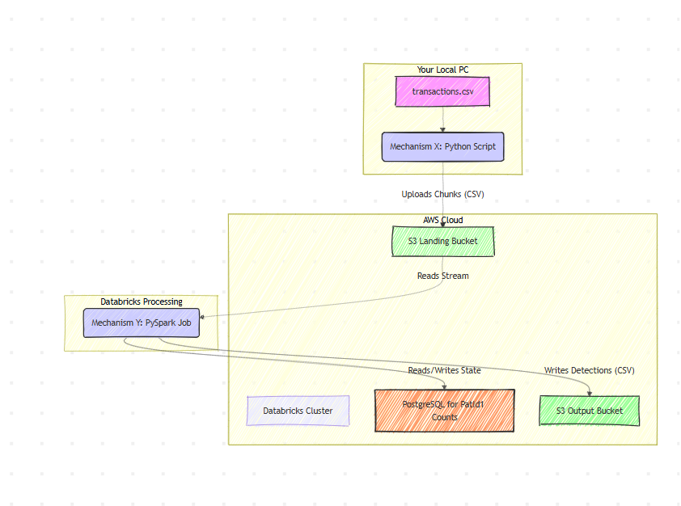

# PySpark Data Engineering Take-Home Assignment

## Project Overview

This project implements a near real-time data pipeline designed to ingest, process, and analyze financial transaction data. The pipeline identifies three distinct behavioral patterns from a stream of transactions, leveraging stateful processing for complex rules and cloud storage for scalability.

The system is composed of two primary microservices:
* **Mechanism X:** A Python-based data producer that simulates a live stream by reading a large transaction CSV file in chunks and uploading them to an AWS S3 bucket every second.
* **Mechanism Y:** A Databricks-based data consumer built with PySpark Structured Streaming. It ingests the data from S3 as it arrives, executes the pattern detection logic, and uses AWS RDS for PostgreSQL to maintain state for complex rules. The final detections are written to a separate S3 bucket.

## Architecture

The end-to-end data flow follows a classic streaming architecture pattern, ensuring scalability and low-latency processing.

**Data Flow:** Local PC -> Mechanism X (Python) -> AWS S3 (Landing Zone) -> Databricks (PySpark Streaming) -> AWS RDS PostgreSQL (State Store) -> AWS S3 (Output Zone)



## Technology Stack

* **Data Processing:** Apache Spark (via Databricks & PySpark)
* **Cloud Platform:** Amazon Web Services (AWS)
* **Storage:** AWS S3
* **Database:** AWS RDS for PostgreSQL (for stateful processing)
* **Programming Languages:** Python, PySpark, SQL
* **Key Python Libraries:** Pandas, Boto3, Psycopg2

## Setup and Prerequisites

To replicate this environment and run the project, the following components must be configured.

### 1. AWS Setup
* **S3 Buckets:** Two S3 buckets are required: one for landing the raw transaction chunks and another for storing the final pattern detections.
* **AWS RDS for PostgreSQL:** A running PostgreSQL instance on AWS RDS, configured to be publicly accessible.
* **IAM User:** An IAM user with programmatic access (`Access Key ID` and `Secret Access Key`) and permissions to read from and write to the specified S3 buckets.

### 2. Local Machine Setup
* Python 3.8+ installed.
* The source `transactions.csv` and `CustomerImportance.csv` files available locally.
* Required Python libraries installed via pip:
    ```bash
    pip install pandas boto3
    ```
* AWS credentials configured locally (e.g., in the `~/.aws/credentials` file) for `mechanism_x.py`.
* The `mechanism_x.py` script configured with the correct S3 landing bucket name and local file path.

### 3. Databricks Setup
* **Cluster:** A running Databricks cluster (e.g., Runtime 13.3 LTS).
* **Libraries:** The cluster must have the following libraries installed via the **Compute -> [Your Cluster] -> Libraries -> Install new -> Maven** tab to enable S3 and PostgreSQL connectivity:
    1.  `org.apache.hadoop:hadoop-aws:3.3.2`
    2.  `com.amazonaws:aws-java-sdk-bundle:1.11.1026`
    3.  `org.postgresql:postgresql:42.3.3`
* **DBFS:** The `CustomerImportance.csv` file must be uploaded to the Databricks File System.
* **Notebook:** The main notebook requires the PostgreSQL driver to be installed in a cell using `%pip install psycopg2-binary`.

### 4. PostgreSQL Database Setup
* Connect to the AWS RDS instance using a SQL client (e.g., DBeaver).
* Execute the following SQL command to create the table for state management:
    ```sql
    CREATE TABLE merchant_transaction_counts (
        merchant_id VARCHAR(255) PRIMARY KEY,
        total_transactions BIGINT
    );
    ```

## How to Run the Pipeline

1.  **Start the Data Producer:** On your local machine, execute the `mechanism_x.py` script to begin uploading transaction data to the S3 landing bucket.
2.  **Start the Data Consumer:** In the Databricks workspace, run the final notebook containing the PySpark streaming logic. This will start the stream processing.
3.  **Verify Output:**
    * Monitor the notebook logs for processing messages.
    * Check the output S3 bucket for new detection files.
    * Query the `merchant_transaction_counts` table in PostgreSQL to observe the stateful counters being updated in real-time.

## Project Components Explained

* **`mechanism_x.py`:** This script simulates a real-world data producer. It reads the source `transactions.csv` file in chunks of 10,000 records and uploads each chunk to S3 every second, creating the data stream.
* **Databricks Notebook (.ipynb):** This is the core data processor (Mechanism Y). It uses PySpark Structured Streaming to:
    * Ingest the data stream from S3.
    * Detect three distinct patterns (`PatId1`, `PatId2`, `PatId3`).
    * For `PatId1`, it connects to the external PostgreSQL database to manage state (total transaction counts) to correctly apply the 50,000 transaction threshold.
    * Writes the final, formatted detections to an output S3 bucket.

## Assumptions Made

* The "50 at a time" output requirement was interpreted as writing detections in chunks, where each micro-batch processed by the stream results in one unique output file. This is a standard and scalable approach for streaming systems.
* The schemas for `transactions.csv` and `CustomerImportance.csv` were inferred from the problem description and are consistent.
* The Databricks cluster has the necessary network permissions to access public Maven repositories and the AWS RDS endpoint.

---
*This project was completed by Krishna Das.*
